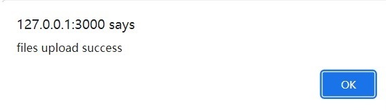

# FRONTEND von tabellen-extraktor
## About this

This is an application for table extraction:
- the frontend is implemented based on _HTML, Ajax and Javascript_
- the server is built by _Node.js_ and _Express_ 
- the backend is mainly implemented by _Python_

It is planned that the _Ajax_ and _Javascript_ parts will be migrated to _Angular_ and _Typescript_

## Setup

- Install *Python*
- Install *Python*-Paketen
- Install *Javascript*
- Install *Node.js*

...not finished

## Start Server

- Start Server use `nodemon main.js` in **Terminal**

- Server runs on http://127.0.0.1:3000/

## Webpage

### Home

### Main operation interface

## Functions
This page integrates:
- file uploading (In the form of **a single image**, or **multiple images**, or **a folder**)
- single file processing
- file batch processing
- visualization of table extraction results
- visualization of _Elasticsearch_ database
- table saving as _Excel_

### Upload and Process

- Select the way to upload files in **_--upload image--_** of the **MENU**, the files will be stored in backend

   - Button _An Image_ is used to upload a image
   - Button _Multi Images_ is used to upload more images, which are selected by **_Ctrl_**
   - Button _A Folder_ is used to upload a folder, in which are the images to be processed
   - The progress bar shows the progress of the file upload, but not the progress of saving to the database! A pop-up prompt will pop up when everything is ready.

- select a model, which shold be used for processing of images to detecte tables

- click **_RUN_**, wait until the message popup appears

- for file batch processing, the total processing progress can be known through the progress bar

### _Now all the processing results and data are saved in the database, let's view them._

### Visualization of table extraction results

- select the image we want to visualize the result in **_MENU_** 

- click the button _SHOW_

- now is the result showing in the area

- the table area can be viewed by **_clicking on an already displayed image_**, and click again will return to the original image.

- now select the table name you want to view on top

The table processing status will be displayed in the left and right areas

  Notice that the graph area on the left is now replaced with the table processing results, if you still want to view the original graph and table area, just click on the graph area on the left

  

### _Now we are done with the visualization, what if I want to view and save the results in elasticsearch?_ ###

### visualization of _Elasticsearch_ database
- click the button _ELASTICSEARCH_ in **_MENU_**

The menu should now be updated.
(Return to the original menu by clicking the top button)

- please click the load button first to load the tables stored in _Elasticsearch_

- tables can now be selected by _uniqueID_ to view

- by selecting in the next drop-down box, you can save all the tables that exist in elasticsearch as excel and download them

- after clicking the button, a download link will be generated

Click the download link and the file will be downloaded to your browser's default download address.

- if you choose to download all sheets, they will be written together into different sheets of an excel file, each sheet is named with the uniqueID

### **_Now that all the functions are shown, some functions can be chosen carefully for ease of work._**

### Other functions
- In the initial menu, you can:

  - choose to clear all data on the backend through the corresponding button 
  
     (Attention, not recoverable!)
  - continue last job
     
     (Attention, only images and their visualizations that have been processed last time can be loaded)

  

- in the menu for _Elasticsearch_, you can:

  - clear all data under index 'table' in _Elasticsearch DB_

## All requiers to Backend

